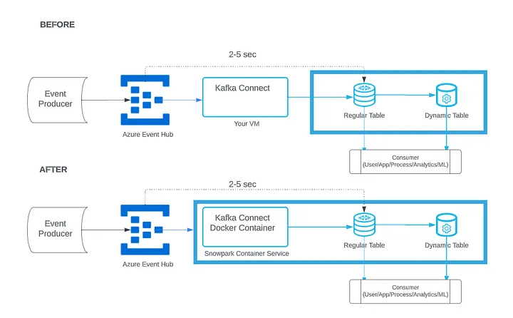

# kafka-connector
Provided details allows you create basic setup of eventhub to snowflake using kafka connect



UBI 8 image is used as the base image to construct the container

Run the following command to build the image based on ubi image

```
docker build -t kafka-connect-ubi8 .
```
After the successfull build run the image in the container. Don't expose the ports if its not required.
```
 docker run -d -p 8083:8083 --name kafka-connect kafka-connect-ubi8
```
Use the following curl request to create connectors . Here in the example created the snowflake connector

```
curl --location 'http://localhost:8083/connectors' \
--header 'Content-Type: application/json' \
--data '{
    "name": "snowflake-sink-connector",
    "config": {
        "connector.class": "com.snowflake.kafka.connector.SnowflakeSinkConnector",
        "tasks.max": "2",
        "topics": "customer_topic",
        "snowflake.url.name": "https://<host>.snowflakecomputing.com:443",
        "snowflake.user.name": "KAFKA_USER",
        "snowflake.password.name": "<password>",
        "snowflake.database.name": "KAFKA_TEST",
        "snowflake.schema.name": "INGESTION",
        "snowflake.private.key": "<privatekey>",
        "snowflake.role.name": "KAFKA_CONNECTOR_ROLE",
        "snowflake.ingestion.method": "SNOWPIPE_STREAMING",
        "snowflake.topic2table.map": "customer_topic:CUSTOMER",
        "buffer.count.records": "10000",
        "buffer.flush.time": "60",
        "buffer.size.bytes": "5000000",
        "snowflake.metadata.createtime": "true",
        "snowflake.metadata.snowpipe": "true",
        "key.converter": "org.apache.kafka.connect.storage.StringConverter",
        "value.converter": "org.apache.kafka.connect.json.JsonConverter",
        "value.converter.schemas.enable": "false"
    }
}'

```

you can get connector details using following commands

```
Get the list:
GET http://localhost:8083/connectors

Delete the connector:
DELETE http://localhost:8083/connectors/<connector_name>
```